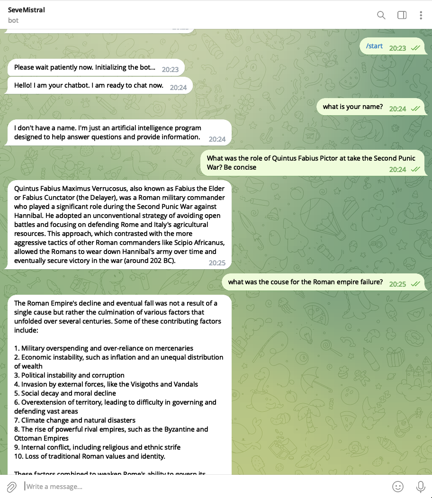

# Telegram Bot Using RAG with Llama-Index and MISTRAL 7B

## Overview
This Telegram bot is built using the Retrieval-Augmented Generation (RAG) framework, incorporating the llama-index library and the MISTRAL 7B model. It is designed to ingest documents and provide responses based on these documents when interacting with users on Telegram.

## Acknowledgments
In building this project, I drew inspiration from the following authors:

- [Iago Modesto Brandão](https://medium.com/poatek/building-open-source-llm-based-chatbots-using-llama-index-e6de9999ee76): Article on building open-source LLM-based chatbots using llama-index.
- [Massimo Chiriatti](https://llamabox.eu/2023/12/28/Esperimenti-di-RAG-Diario.html?fbclid=IwAR24fFeprjiO5XbwI0Z1CTdZSChbnmEX00d3AaSzTsnPt23z8JnBgHvwbQo): Article on experiments with RAG (Retrieval-Augmented Generation).

## Known Performance Issues
I find running MISTRAL 7B on CPU only very challenging. Shall move to GPU environment.

## Features
- **Document Ingestion**: Automates the ingestion of documents from a specified directory.
- **Interactive Chat**: Users can ask questions and receive answers based on the ingested documents.
- **RAG Infrastructure**: Utilizes RAG for enhanced natural language processing.
- **MISTRAL 7B Model**: Leverages the MISTRAL 7B model for advanced language understanding and generation.

## Prerequisites
- Python 3.10
- Telegram Bot API Token.
- MISTRAL7B running locally 

## Setup
1. **Clone the Repository**:
   ```bash
   git clone [Your-Repository-URL]
   ```
   Replace `[Your-Repository-URL]` with the actual URL of your repository.

2. **Install Dependencies**:
   ```bash
   pip install -r requirements.txt
   ```
   This command installs all the necessary dependencies listed in `requirements.txt`.

3. **Run MISTRAL**:

   ### On MacOS (Apple Silicon Tested):
   Ollama Docker based should work on macOS too with M2 chips but I didn't succeed.
   1. **Install OLLAMA**:
      - Ensure OLLAMA is installed on your MacOS system. Compatible with Apple Silicon (tested on M2).
      - Download it from [here](https://ollama.ai/download): Select the macOS platform 
   2. **Run MISTRAL**:
      - Execute the command: 
        ```bash
        ollama run mistral
        ```

   ### On Linux:
   1. **CPU Only: Install OLLAMA Using Docker**:
      - Pull the OLLAMA Docker image:
        ```bash
        docker pull ollama/ollama
        ```
      - Run the OLLAMA inside a Docker container:
        ```bash
        docker run -d -v ollama:/root/.ollama -p 11434:11434 --name ollama ollama/ollama
        ```
      - This setup is recommended for optimal performance, especially on systems equipped with an NVIDIA GPU.
   2. **GPU Only**:
      - Install the [Nvidia container toolkit](https://docs.nvidia.com/datacenter/cloud-native/container-toolkit/latest/install-guide.html#installation):
      - Run the OLLAMA inside a Docker container:
        ```bash
        docker run -d --gpus=all -v ollama:/root/.ollama -p 11434:11434 --name ollama ollama/ollama
        ```
      - This setup is recommended for optimal performance, especially on systems equipped with an NVIDIA GPU.

4. **Configure Environment Variables**:
   - Create a `.env` file in your project root. You can rename `.env.example` to `.env` if a template is provided.
   - Add the following line with your Telegram Bot Token:
     ```
     TELEGRAM_BOT_TOKEN=your_telegram_bot_token
     ```
     Replace `your_telegram_bot_token` with your actual Telegram Bot Token.

5. **Prepare Documents Directory**:
   - Place the documents you want the bot to ingest in the `./docs` directory.

## Running the Bot
To run the bot, execute the following command:
```bash
python app.py
```

## Usage
Once your Telegram bot is set up and running, follow these steps to interact with it:

1. **Start the Bot**:
   - In Telegram, open a chat with your bot.
   - Send the `/start` command to initialize the bot. This command triggers the bot to ingest documents and prepares it for interaction.

2. **Interacting with the Bot**:
   - After initialization, you can start interacting with the bot.
   - Simply send a message or question, and the bot will respond based on the ingested documents.



3. **Help Command**:
   - If you need assistance or want to know more about the bot's capabilities, send the `/help` command.

Remember, the first time you interact with the bot after starting it, initialization might take a few moments, especially if it's processing a large number of documents.


## How to Create a Telegram Bot

Creating a Telegram bot is a straightforward process. You will be interacting with BotFather, the official bot by Telegram, to create and manage your bot. Follow these steps to create your Telegram bot:

### Step 1: Start a Conversation with BotFather

1. Open Telegram.
2. Search for the "BotFather" bot (verified bot with a blue checkmark) or navigate directly using this link: [BotFather](https://t.me/botfather).
3. Start a chat with BotFather.

### Step 2: Create a New Bot

1. Send the `/newbot` command to BotFather.
2. BotFather will ask you for a name for your bot. This is a friendly name that will be displayed to users.
3. Next, you will be asked to choose a username for your bot. This must be unique and end with the word 'bot'. For example, `SampleBot`.

### Step 3: Get Your Bot Token

1. Once the bot is created, BotFather will provide you with a token.
2. Keep this token secure as it provides full access to your bot.
3. You will use this token in your project's `.env` file as shown:
   ```
   TELEGRAM_BOT_TOKEN=your_telegram_bot_token
   ```

### Step 4: Configuring Your Bot

1. You can set up additional configurations for your bot by sending commands to BotFather.
2. For instance, you can set a profile picture, description, and about info using `/setuserpic`, `/setdescription`, and `/setabouttext` respectively.

### Step 5: Start Your Bot

- After setting up your bot in Telegram and configuring it in your project, run your bot script. Your bot should now be live and responsive to messages in Telegram.

### Note

- Keep your bot token confidential and secure. Anyone with the token can control your bot.
- You can always go back to BotFather to edit your bot's settings, regenerate the token, or delete the bot.

## Logging
- The bot includes logging to track operations and diagnose issues.
- Logs provide insights into the bot's performance and error handling.

## Contributing
Contributions to the project are welcome. To contribute:
1. Fork the repository.
2. Create a new branch for your feature (`git checkout -b feature/AmazingFeature`).
3. Commit your changes (`git commit -m 'Add some AmazingFeature'`).
4. Push to the branch (`git push origin feature/AmazingFeature`).
5. Open a pull request.

## License
This project is licensed under the GPL3 - see the LICENSE file for details.

## Contact
For support or queries, reach out to Simone Severini.